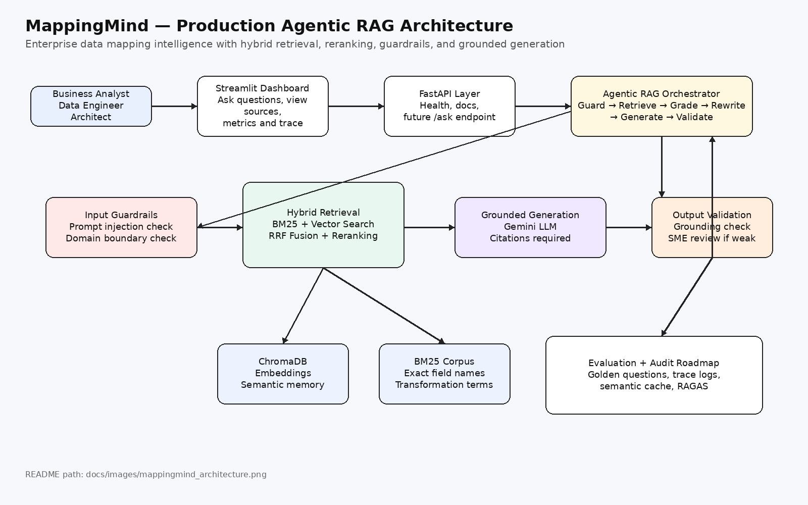
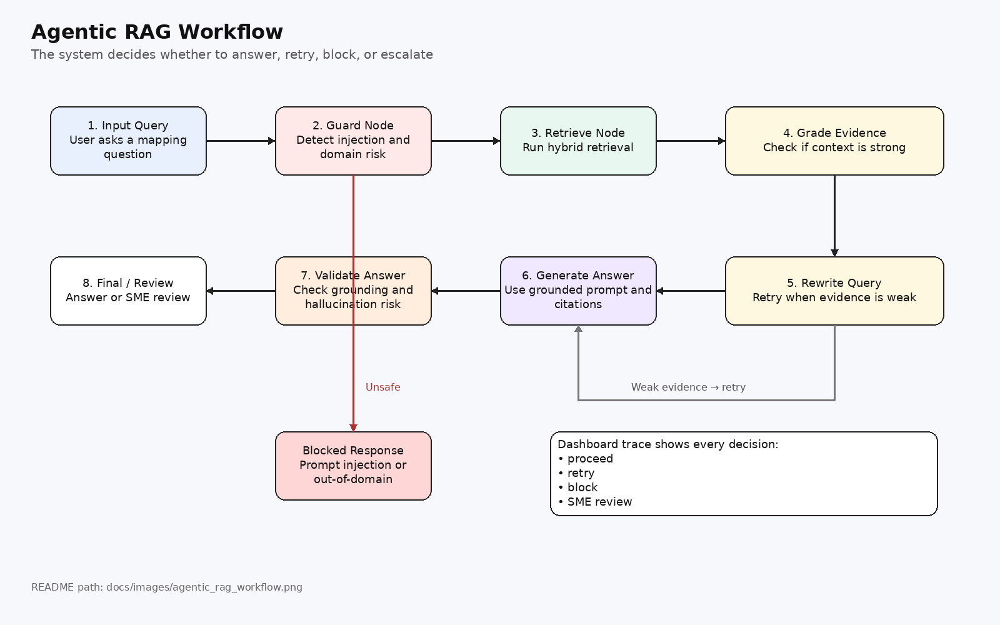
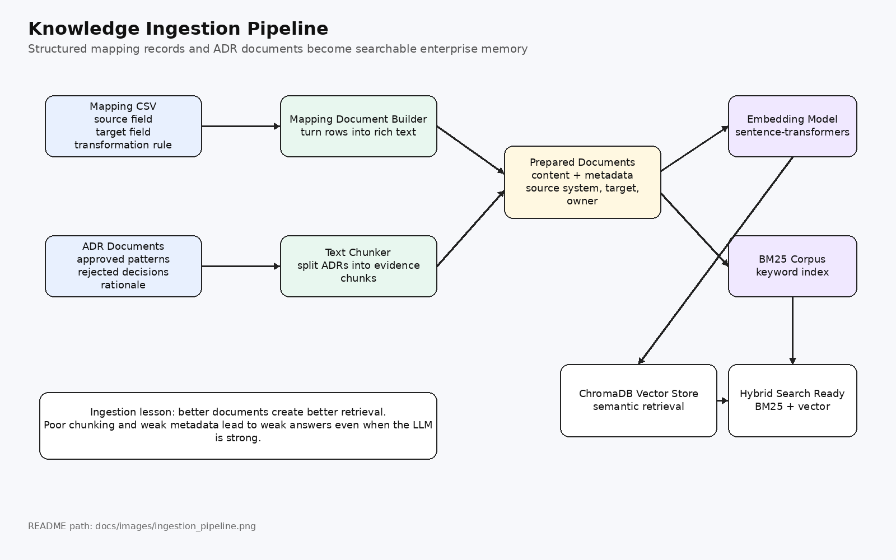
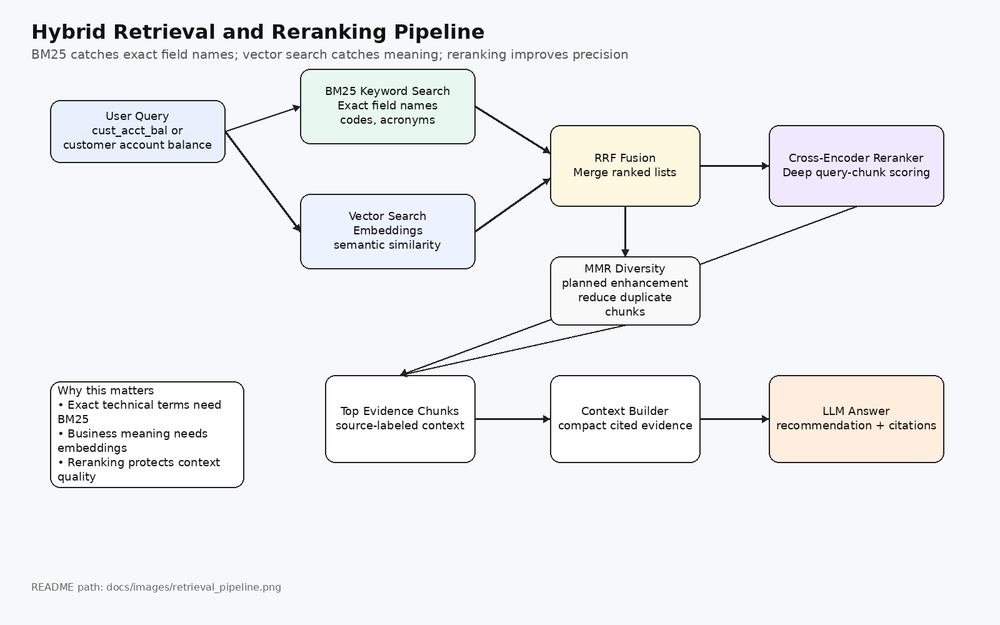
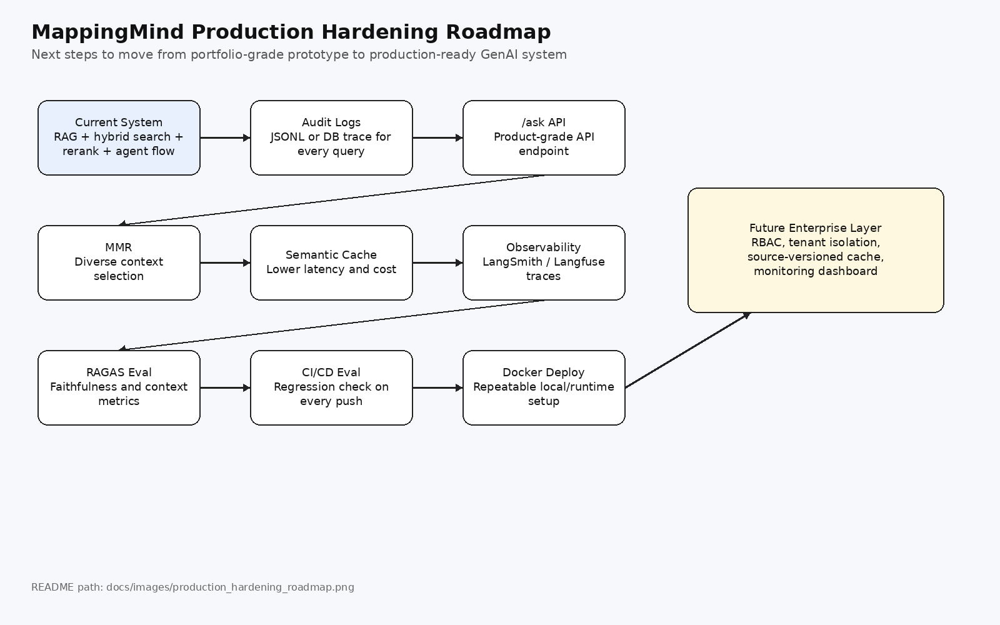

# The MappingMind AI Project

## Phase 1 RAG Systems: Enterprise Data Mapping Intelligence

### A Learner-Focused Journey into Production Agentic RAG Systems

Learn to build a modern AI system from the ground up through hands-on implementation.

Master the most in-demand AI engineering skills: RAG, hybrid search, embeddings, vector databases, reranking, prompt engineering, context engineering, guardrails, evaluation, monitoring foundations, caching foundations, and Agentic RAG.




---

## About This Course

This is a learner-focused project where you build a complete enterprise data mapping assistant that understands mapping sheets, transformation rules, architecture decision records, and past implementation decisions.

MappingMind teaches you to build a production-style RAG system using practical engineering patterns. Unlike basic tutorials that jump straight to “chat with documents,” this project follows the professional path: start with clean application structure, build ingestion, add keyword retrieval, add semantic retrieval, combine both with hybrid search, improve precision with reranking, and then wrap the full system with Agentic RAG, guardrails, evaluation, monitoring, and production-hardening patterns.

> The Professional Difference: We build RAG systems the way successful enterprise teams do — strong retrieval foundations enhanced with AI, not AI-first demos that ignore search quality, evidence control, and governance.

By the end of this project, you will have your own AI-powered enterprise mapping assistant and the technical skills to explain production Agentic RAG systems for any enterprise domain.

---

### What You'll Build

* Week 1: Complete application foundation with FastAPI, Streamlit, virtual environment, safe configuration, and project structure
* Week 2: Data ingestion pipeline for mapping CSVs and architecture decision records
* Week 3: BM25 keyword search for exact field names, mapping rules, and transformation terms
* Week 4: Chunking and hybrid search foundation with embeddings, ChromaDB, and semantic retrieval
* Week 5: Complete RAG pipeline with Gemini LLM, grounded answers, citations, and Streamlit interface
* Week 6: Production monitoring and caching foundations with RAGAS evaluation, LangSmith-ready tracing, and optimization roadmap
* Week 7: Agentic RAG with guardrails, evidence grading, query rewriting, validation, and SME review escalation

---

## System Architecture Evolution

### Week 7: Agentic RAG for Enterprise Data Mapping


Complete Week 7 architecture showing how the enterprise data mapping assistant connects the dashboard, API layer, Agentic RAG workflow, hybrid retrieval, reranking, grounded generation, validation, and production hardening roadmap.

---

### LangGraph Agentic RAG Workflow



Detailed agentic workflow showing decision nodes, document grading, adaptive retrieval, query rewriting, answer validation, and SME review escalation.

Key Innovations in Week 7:

* Intelligent Decision-Making: The agent evaluates whether to answer, retry, block, or escalate
* Document Grading: Retrieved context is checked before generation
* Query Rewriting: Weak queries are refined and retried
* Guardrails: Prompt-injection and out-of-domain detection reduce unsafe behavior
* Grounding Validation: Answers are checked against retrieved evidence
* SME Review: Weak or unsupported answers are escalated instead of hallucinated
* Transparency: Full agent trace is available for debugging and trust

---

## Quick Start

### Prerequisites

* Python 3.12+
* Git
* Google Gemini API key
* Optional LangSmith API key
* 4GB+ RAM recommended
* Windows, macOS, or Linux

---

### Get Started

```bash
# 1. Clone and setup
git clone https://github.com/punamsahu1-spec/mappingmind.git
cd mappingmind

# 2. Create virtual environment
python -m venv venv
venv\Scripts\activate

# 3. Install dependencies
pip install -r requirements.txt

# 4. Configure environment
copy .env.example .env
```

For macOS/Linux:

```bash
python -m venv venv
source venv/bin/activate
pip install -r requirements.txt
cp .env.example .env
```

Update `.env` with your own local keys:

```env
GOOGLE_API_KEY=your_google_api_key_here
LANGSMITH_API_KEY=your_langsmith_api_key_here
LANGSMITH_PROJECT=mappingmind
LANGCHAIN_TRACING_V2=true
```

Important:

```text
Never commit .env to GitHub.
Only .env.example should be tracked.
```

Run ingestion:

```bash
python core/ingest.py
```

Run the API:

```bash
uvicorn api.main:app --reload
```

Run the dashboard:

```bash
streamlit run dashboard/app.py
```

---

### Weekly Learning Path

| Week   | Topic                                                                                                     | Status     | Code Area                                                                |
| ------ | --------------------------------------------------------------------------------------------------------- | ---------- | ------------------------------------------------------------------------ |
| Week 1 | [Infrastructure Foundation](#week-1-infrastructure-foundation-)                                           | ✅ Complete | `api/`, `dashboard/`, `core/`, `.env.example`, `requirements.txt`        |
| Week 2 | [Data Ingestion Pipeline](#week-2-data-ingestion-pipeline-)                                               | ✅ Complete | `core/ingest.py`, `data/`, ChromaDB                                      |
| Week 3 | [Keyword Search First - The Critical Foundation](#week-3-keyword-search-first---the-critical-foundation-) | ✅ Complete | `core/retrieval.py`                                                      |
| Week 4 | [Chunking & Hybrid Search - The Semantic Layer](#week-4-chunking--hybrid-search---the-semantic-layer-)    | ✅ Complete | `core/ingest.py`, `core/retrieval.py`, ChromaDB                          |
| Week 5 | [Complete RAG Pipeline with LLM Integration](#week-5-complete-rag-pipeline-with-llm-integration-)         | ✅ Complete | `core/generation.py`, `dashboard/app.py`                                 |
| Week 6 | [Production Monitoring and Caching](#week-6-production-monitoring-and-caching-)                           | ✅ Complete | `core/evaluation.py`, LangSmith-ready config, monitoring/caching roadmap |
| Week 7 | [Agentic RAG and Guardrails](#week-7-agentic-rag--guardrails-)                                            | ✅ Complete | `core/agent.py`, `core/guardrails.py`                                    |

---

### Clone a Specific Week Release

Weekly tags are planned for learning checkpoints. After tags are created, use this pattern:

```bash
# Clone a specific week's code
git clone --branch <WEEK_TAG> https://github.com/punamsahu1-spec/mappingmind.git
cd mappingmind

# Replace <WEEK_TAG> with: week1.0, week2.0, week3.0, etc.
python -m venv venv
venv\Scripts\activate
pip install -r requirements.txt
```

Suggested future tags:

```text
week1.0-infra-foundation
week2.0-data-ingestion
week3.0-keyword-search
week4.0-hybrid-search
week5.0-complete-rag
week6.0-monitoring-caching
week7.0-agentic-rag
```

---

### Access Your Services

| Service              | URL / Command                  | Purpose                              |
| -------------------- | ------------------------------ | ------------------------------------ |
| API Documentation    | `http://127.0.0.1:8000/docs`   | Interactive API testing              |
| Health Check         | `http://127.0.0.1:8000/health` | Verify backend service is running    |
| Streamlit Dashboard  | `http://localhost:8501`        | User-friendly MappingMind interface  |
| Knowledge Ingestion  | `python core/ingest.py`        | Load mapping knowledge into ChromaDB |
| Evaluation Module    | `python core/evaluation.py`    | Run RAGAS-style evaluation checks    |
| ChromaDB Local Store | `data/chroma_store/`           | Local vector store persistence       |

---

## Week 1: Infrastructure Foundation ✅

Start here. Master the application foundation that powers modern RAG systems.

### Learning Objectives

* FastAPI backend setup with automatic documentation and health checks
* Streamlit dashboard for interactive user experience
* Safe environment variable management with `.env.example`
* Local Python virtual environment setup
* Clean project structure with separate API, dashboard, and core AI logic
* Professional Git hygiene for secrets and generated files

### Architecture Overview


Infrastructure Components:

* FastAPI: REST API layer with root and health endpoints
* Streamlit: User-facing dashboard for asking mapping questions
* Core AI Modules: Agent, retrieval, generation, guardrails, evaluation
* Environment Layer: `.env.example` for safe configuration
* Local Runtime: Python virtual environment and dependency management

### Setup Guide

```bash
# Create virtual environment
python -m venv venv

# Activate virtual environment on Windows
venv\Scripts\activate

# Install dependencies
pip install -r requirements.txt

# Create local env file
copy .env.example .env
```

Completion Guide:

* Confirm the repo has `api/`, `core/`, `dashboard/`, and `data/`
* Confirm FastAPI can start with `uvicorn api.main:app --reload`
* Confirm dashboard can start with `streamlit run dashboard/app.py`
* Confirm `.env` is local only and `.env.example` is tracked

### Deep Dive

The most important production design choice in Week 1 is separation of concerns. The UI should not contain retrieval logic. The API should not contain prompt engineering. The agent should orchestrate the workflow, while retrieval, generation, guardrails, and evaluation remain separate modules.

---

## Week 2: Data Ingestion Pipeline ✅

Building on Week 1 infrastructure: Learn to process enterprise mapping knowledge into a searchable knowledge base.

### Learning Objectives

* Load structured mapping records from CSV files
* Convert mapping rows into rich natural-language documents
* Load architecture decision records as unstructured evidence
* Chunk decision documents for retrieval
* Attach metadata for source traceability
* Persist processed knowledge in ChromaDB
* Cache processed chunks for faster retrieval startup

### Architecture Overview



Data Pipeline Components:

| Component                | Current Implementation                                    |
| ------------------------ | --------------------------------------------------------- |
| Mapping CSV Loader       | Loads mapping rows from `data/mappings.csv`               |
| Mapping Document Builder | Converts each mapping row into rich natural-language text |
| ADR Loader               | Loads internal ADR-style decision documents               |
| Text Chunker             | Splits ADR documents using recursive chunking             |
| Embedding Model          | Uses local sentence-transformer embeddings                |
| Vector Store             | Stores chunks in ChromaDB under `data/chroma_store/`      |
| Chunk Cache              | Saves processed chunks to `data/chunks_cache.pkl`         |

### Implementation Guide

```bash
# Run ingestion
python core/ingest.py
```

Completion Guide:

* Mapping CSV rows should load successfully
* ADR documents should load successfully
* ADR documents should be chunked
* ChromaDB store should be created locally
* Chunk cache should be created locally

### Deep Dive

Better ingestion creates better retrieval. Poorly prepared documents lead to weak answers even when the LLM is strong. MappingMind treats ingestion as the foundation of trust because mapping answers depend on source quality, metadata, and decision history.

---

## Week 3: Keyword Search First - The Critical Foundation ✅

Building on Weeks 1-2 foundation: Implement the keyword search foundation that professional RAG systems rely on.

### Learning Objectives

* Understand why keyword search is essential for RAG systems
* Use BM25 to retrieve exact field names and transformation terms
* Support technical identifiers such as `cust_acct_bal`
* Retrieve exact mapping records before using semantic search
* Establish a retrieval baseline before adding vectors
* Understand why enterprise systems often need keyword and vector search together

### Architecture Overview



Search Infrastructure Components:

* BM25 Retriever: Finds exact terms, field names, and transformation patterns
* Mapping Corpus: Searchable text from mapping records and ADR chunks
* Relevance Scores: Keyword-based ranking signal
* Retrieval Baseline: Foundation for hybrid retrieval

### Setup Guide

```bash
# Run retrieval tests or execute retrieval module
python core/retrieval.py
```

Completion Guide:

* Test a query with an exact source-field name
* Verify that keyword retrieval surfaces relevant mapping records
* Compare exact-field queries with business-language queries

### Deep Dive

Enterprise RAG cannot rely only on embeddings. Field names, abbreviations, table names, system codes, and transformation identifiers often require exact keyword search. BM25 protects precision when users ask about technical mapping terms.

---

## Week 4: Chunking & Hybrid Search - The Semantic Layer ✅

Building on Week 3 foundation: Add the semantic layer that makes search understand business meaning.

### Learning Objectives

* Generate embeddings for mapping knowledge
* Store vectors in ChromaDB
* Retrieve conceptually similar mapping examples
* Compare keyword search with semantic search
* Combine BM25 and vector search using RRF fusion
* Understand why hybrid retrieval improves production RAG quality

### Architecture Overview


Hybrid Search Infrastructure Components:

* Text Chunker: Splits ADRs and mapping documents into retrievable units
* Embedding Model: Converts mapping knowledge into vectors
* ChromaDB: Stores vector embeddings for semantic retrieval
* BM25 Search: Retrieves exact terms and technical identifiers
* RRF Fusion: Combines keyword and semantic rankings
* Unified Retrieval Function: Returns candidate evidence for reranking

### Setup Guide

```bash
# Rebuild knowledge base
python core/ingest.py

# Test retrieval pipeline
python core/retrieval.py
```

Completion Guide:

* Compare keyword-only, vector-only, and hybrid retrieval results
* Confirm field-name and business-language queries both work
* Confirm fused results are passed forward for reranking

### Deep Dive

Hybrid retrieval is often the practical production default. BM25 captures exact technical precision. Vector search captures meaning. RRF balances both result sets without requiring one search mode to dominate the other.

---

## Week 5: Complete RAG Pipeline with LLM Integration ✅

Building on Week 4 hybrid search: Add the LLM layer that turns search into grounded enterprise answers.

### Learning Objectives

* Build retrieved context for the LLM
* Use a grounded generation prompt
* Require source-backed responses
* Generate mapping recommendations and transformation logic
* Return citations, risks, assumptions, and confidence signals
* Display the final response in the Streamlit dashboard

### Architecture Overview


Complete RAG Infrastructure Components:

* Retrieval Pipeline: BM25 + vector search + RRF
* Cross-Encoder Reranker: Improves evidence precision
* Context Builder: Formats cited evidence for the LLM
* Gemini LLM: Generates grounded answers
* System Prompt: Restricts the answer to retrieved context
* Dashboard: Shows answer, sources, metrics, and trace

### Setup Guide

```bash
# Run ingestion first
python core/ingest.py

# Start dashboard
streamlit run dashboard/app.py
```

Completion Guide:

* Ask a mapping question in the dashboard
* Verify that the answer includes source evidence
* Verify that retrieved sources are visible
* Verify that the system refuses or escalates weak evidence

### Deep Dive

The LLM is not the knowledge source. The retrieved context is the knowledge source. The LLM’s job is to synthesize a clear answer from the evidence provided by the retrieval pipeline.

---

## Week 6: Production Monitoring and Caching ✅

Building on Week 5 complete RAG system: Add production monitoring foundations, evaluation, and performance optimization patterns.

### Learning Objectives

* Understand why production RAG requires observability
* Track query behavior, answer quality, and retrieval decisions
* Prepare for LangSmith or Langfuse tracing
* Run RAGAS-style evaluation for answer quality
* Prepare semantic caching for repeated questions
* Track cost and latency optimization opportunities

### Architecture Overview



Production Monitoring and Caching Components:

| Component                | Current Status                                 |
| ------------------------ | ---------------------------------------------- |
| RAGAS Evaluation         | ✅ Implemented in `core/evaluation.py`          |
| Faithfulness Metric      | ✅ Implemented                                  |
| Answer Relevancy Metric  | ✅ Implemented                                  |
| LangSmith Config         | ✅ Environment variables present                |
| Monitoring Foundation    | ✅ Agent trace and evaluation outputs           |
| Caching Foundation       | ✅ Roadmap defined; implementation planned next |
| Persistent Audit Log     | ✅ Roadmap defined; implementation planned next |
| Cost / Latency Dashboard | ✅ Roadmap defined; implementation planned next |

### Setup Guide

```bash
# Run RAGAS-style evaluation
python core/evaluation.py
```

Completion Guide:

* Run evaluation after ingestion
* Confirm evaluation produces faithfulness and answer relevancy scores
* Confirm results are saved under `data/eval_results/`
* Keep generated evaluation output out of Git if it is local-only

### Deep Dive

Production monitoring is not just logging the final answer. A production RAG system should trace the full path: query, retrieval mode, retrieved chunks, reranking, prompt, model response, validation result, latency, and final decision.

---

## Week 7: Agentic RAG & Guardrails ✅

Building on Week 6 monitoring foundation: Add agentic decisioning, retries, validation, and safety.

### Learning Objectives

* Implement an agentic workflow around RAG
* Add input guardrails before retrieval
* Grade retrieved evidence before generation
* Rewrite weak queries and retry retrieval
* Validate whether the final answer is grounded
* Escalate weak answers instead of hallucinating
* Explain how Agentic RAG differs from basic RAG

### Architecture Overview


Agentic RAG Components:

* Guard Node: Detects prompt injection and domain violations
* Retrieve Node: Runs hybrid retrieval
* Grade Documents Node: Checks whether retrieved evidence is strong enough
* Rewrite Query Node: Improves weak queries and retries retrieval
* Generate Answer Node: Produces grounded response from retrieved context
* Validate Answer Node: Checks grounding and hallucination risk
* SME Review Path: Escalates weak or unsupported answers

### Setup Guide

```bash
# Run the agent workflow directly
python core/agent.py

# Or run through dashboard
streamlit run dashboard/app.py
```

Completion Guide:

* Test a normal mapping question
* Test a weak-evidence question
* Test a prompt-injection attempt
* Confirm the agent trace shows guard, retrieve, grade, generate, validate, and review decisions

### Deep Dive

Agentic RAG is useful when the system needs control decisions. Basic RAG retrieves and answers. Agentic RAG decides whether to retrieve, rewrite, answer, block, or escalate.

---

## Reference and Development Guide

### Tech Stack

| Layer          | Technology                | Purpose                                      |
| -------------- | ------------------------- | -------------------------------------------- |
| Language       | Python 3.12+              | Core application language                    |
| API            | FastAPI                   | Backend API and health endpoints             |
| UI             | Streamlit                 | Interactive user dashboard                   |
| LLM            | Gemini                    | Answer generation                            |
| Embeddings     | Sentence Transformers     | Semantic representation of mapping knowledge |
| Vector Store   | ChromaDB                  | Local vector database                        |
| Keyword Search | BM25                      | Exact field and term matching                |
| Fusion         | Reciprocal Rank Fusion    | Combines keyword and vector results          |
| Reranking      | Cross-Encoder             | Improves final evidence precision            |
| Guardrails     | Custom Python checks      | Prompt injection and domain safety           |
| Evaluation     | RAGAS + custom test cases | Faithfulness and answer relevancy checks     |
| Observability  | LangSmith-ready config    | Future tracing and monitoring                |

---

### Project Structure

```text
mappingmind/
  api/
    main.py
  core/
    agent.py
    evaluation.py
    generation.py
    guardrails.py
    ingest.py
    retrieval.py
  dashboard/
    app.py
  data/
    mappings.csv
    chroma_store/
    chunks_cache.pkl
  docs/
    images/
      mappingmind_architecture.png
      agentic_rag_workflow.png
      retrieval_pipeline.png
      ingestion_pipeline.png
      production_hardening_roadmap.png
  .env.example
  .gitignore
  requirements.txt
  README.md
```

---

### API Endpoint Reference

| Endpoint   | Method | Purpose                                           |
| ---------- | ------ | ------------------------------------------------- |
| `/`        | GET    | Root service information                          |
| `/health`  | GET    | Health check                                      |
| `/docs`    | GET    | FastAPI interactive documentation                 |
| `/ask`     | POST   | Planned endpoint for asking MappingMind questions |
| `/ingest`  | POST   | Planned endpoint for triggering ingestion         |
| `/metrics` | GET    | Planned endpoint for service and query metrics    |
| `/eval`    | POST   | Planned endpoint for running evaluation           |

Planned `/ask` request body:

```json
{
  "query": "How should we map customer account balance from CoreBanking?",
  "user_id": "demo_user",
  "system_filter": "CoreBanking"
}
```

Planned `/ask` response body:

```json
{
  "answer": "Recommended mapping with transformation logic...",
  "sources": ["mappings.csv", "ADR-001"],
  "agent_trace": ["guard", "retrieve", "grade", "generate", "validate"],
  "grounding_score": 0.86,
  "decision": "answered"
}
```

---

### Essential Commands

```bash
# Create virtual environment
python -m venv venv

# Activate on Windows
venv\Scripts\activate

# Activate on macOS/Linux
source venv/bin/activate

# Install dependencies
pip install -r requirements.txt

# Create env file
copy .env.example .env

# Run ingestion
python core/ingest.py

# Run API
uvicorn api.main:app --reload

# Run dashboard
streamlit run dashboard/app.py

# Run evaluation
python core/evaluation.py

# Check Git status
git status
```

---

### Target Audience

This project is designed for:

* AI engineers learning production RAG
* Data engineers learning GenAI architecture
* Solution architects learning Agentic RAG
* Product engineers building enterprise AI assistants
* Technical leaders evaluating practical GenAI system design
* Learners who want a weekend-buildable but serious GenAI portfolio project

---

### Troubleshooting

| Problem                              | Likely Cause                                   | Fix                                             |
| ------------------------------------ | ---------------------------------------------- | ----------------------------------------------- |
| Gemini call fails                    | Missing or invalid `GOOGLE_API_KEY`            | Update `.env` with a valid key                  |
| `.env` appears in GitHub             | File was tracked before `.gitignore` was fixed | Run `git rm --cached --sparse .env` and push    |
| ChromaDB has stale data              | Old local vector store                         | Delete `data/chroma_store/` and rerun ingestion |
| Streamlit cannot import core modules | Wrong working directory                        | Run commands from repo root                     |
| FastAPI does not start               | Missing dependencies                           | Run `pip install -r requirements.txt`           |
| Evaluation gives weak results        | Knowledge base not ingested                    | Run `python core/ingest.py` first               |
| Prompt-injection test is not blocked | Guardrail patterns need update                 | Extend `core/guardrails.py` patterns            |

---

### Get Help

If something fails:

1. Check that your virtual environment is activated.
2. Confirm `.env` exists locally and contains keys.
3. Run ingestion before running the dashboard.
4. Run commands from the project root.
5. Check `git status` before committing.
6. Review generated files and ensure `.env`, cache, logs, and ChromaDB store are not committed.

Useful local checks:

```bash
git status
git ls-files | findstr ".env"
python --version
pip list
```

---

### Cost Structure

MappingMind is designed to run with minimal cost.

| Component                        | Cost                      |
| -------------------------------- | ------------------------- |
| Python                           | Free                      |
| FastAPI                          | Free                      |
| Streamlit local app              | Free                      |
| ChromaDB local vector store      | Free                      |
| Sentence Transformers embeddings | Free locally              |
| BM25 retrieval                   | Free                      |
| Cross-Encoder reranking          | Free locally              |
| Gemini API                       | Depends on API usage      |
| LangSmith                        | Optional; depends on plan |
| GitHub hosting                   | Free for public repo      |

Recommended low-cost usage:

* Use small sample documents during development
* Keep top-k retrieval small
* Use reranking only on shortlisted chunks
* Add semantic cache before scaling repeated queries
* Track token usage when moving beyond demo mode

---

## Security Notes

* Do not commit `.env`
* Use `.env.example` for placeholders only
* Rotate API keys if they were ever committed
* Keep vector stores, cache files, logs, and generated files out of Git
* Add role-based filtering before using real enterprise data

Recommended `.gitignore` entries:

```gitignore
.env
.env.*
!.env.example

venv/
.venv/
__pycache__/
*.pyc

data/chroma_store/
data/chunks_cache.pkl
data/eval_results/
*.pkl
logs/
data/semantic_cache.json
```

---

## Known Limitations

MappingMind is a portfolio-grade production RAG prototype, not a full enterprise deployment.

Current limitations:

* Uses sample data, not a real enterprise mapping repository
* Prompt-injection defense is rule-based
* Persistent audit logging can be made stronger with JSONL/database storage
* Semantic cache implementation is planned next
* MMR diversity selection is planned next
* Multi-tenant access control is not yet implemented
* Full observability dashboard is not yet wired
* MCP and multi-agent workflows are intentionally out of scope for this phase

---

## Ready to Start Your AI Journey?

MappingMind helps you learn the practical implementation patterns behind modern Production Agentic RAG systems:

* keyword search first
* semantic retrieval second
* hybrid search for production quality
* reranking for precision
* agentic control flow for reliability
* guardrails for safety
* evaluation for regression checks
* auditability for governance

Start with Week 1, build each layer step by step, and by Week 7 you will have a serious enterprise-grade GenAI portfolio project.

> Build the system. Understand the trade-offs. Explain the architecture.
